# The_Apostle
Portfolio Project One:
The Apostle is a website that informs users about the luxury spa and holiday resort "The Apostle", it  aims to provide the users with a method to get information and to get in contact with the hotel for the purposes of booking a stay or getting more in depth information regarding the resort. View the live link [here](https://noahdr17.github.io/The_Apostle/)

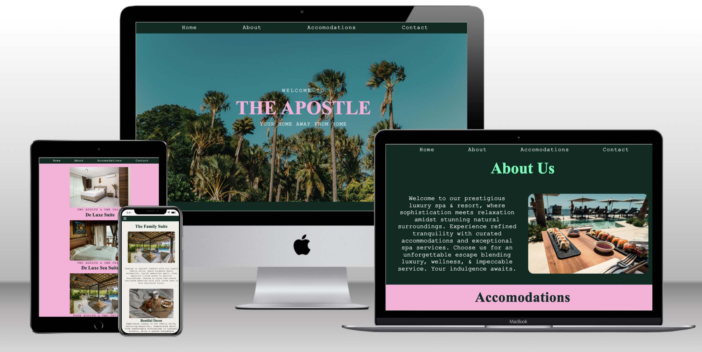

## Project Goals:
* Create a quality website adhering to industry standards and best practises.
* Create something that not only is functional and well made, but also visually appealing and utilizes smart design thinking to capture, maintain and lead the users attention throughout the whole website.
* Gain experience creating something without any external help/guides.

## Target Audience
* The Apostle resort welcomes anyone looking for a vacation spent in luxury, boasting a wide array of opportunities and activities for everyone. The website will cater more specifically to adults, as its main function will be to give information and a method to get in contact with the resort, which is something that only adults will be doing. 

## Theme 
* The theme of the website will be positive, friendly and luxurious, following a fresh, and natural colour scheme with colours contrasting with relation to importance, this is a method used to draw users attention, for example the h1 element on the landing page is a soft pink, which contrasts well with the different shades of green, white, this will draw the eye of the user, without it being an eye sore. 
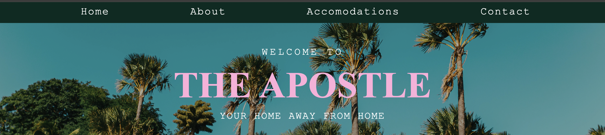

## Features
### Global Features: 
* Navigation Menu 
    * Contains a link to the Home, About Us, Accommodations, and contact pages, and is responsive on all devices.
    * This allows users to easily navigate through the site.
    * With screen sizes with a width below 768px, the navbar gains a dropdown icon to better accomodate the links on a smaller screen size, after clicking the drop down icon the navbar will display in a list below the icon, allowing the user to look at the links when they want to and not have to worry about it taking up space when not in use.

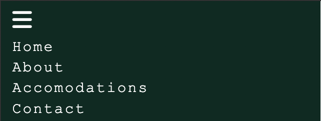

* Favicon 
    * Spans all pages of the website.
    * Allows users to easily distinguish the site among other tabs.
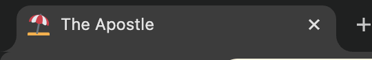

* 404 
    * The 404 page makes it easier for the user to return to the website.
    * Will display if the user utilises a broken link.

### Landing Page 
* Layout 
    *Contains a small amount of text meant only to hook the attention of the reader and prompt them to scroll
    *Avoids overwhelming the user with imformation as soon as they open the page.

* Background image
    * Immediately sets the tone for the website, creating a visually aesthetic and welcoming first impression.
    * sets the baseline for the colours that will be used throughout the rest of the site.

* About Us Section
    * This provides information about "The Apostle" to the user.
    * Includes an image which showcases the pool bar.
    * The history section provides information on The Apostle's past, and how it came to be, this gives the resort more life and depth.
    * Following the history section we have more general information, Dining Experience, Activities and Excursions, Events and Celebrations, and Information about The Apostle's passion for environmental conservation. This works to give more "meat" to the website, making it seem more realistic.
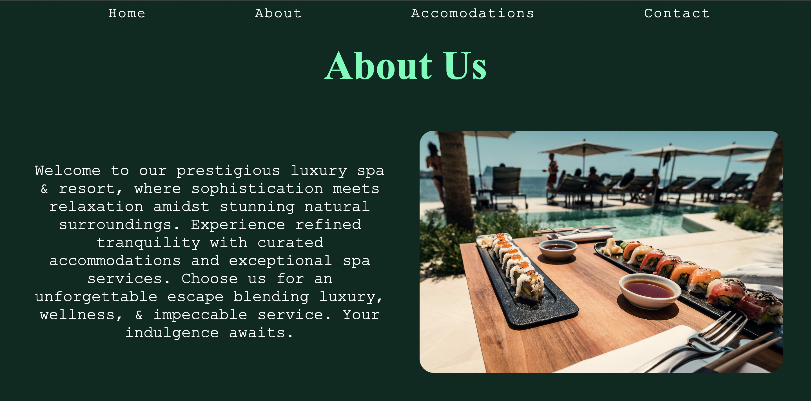
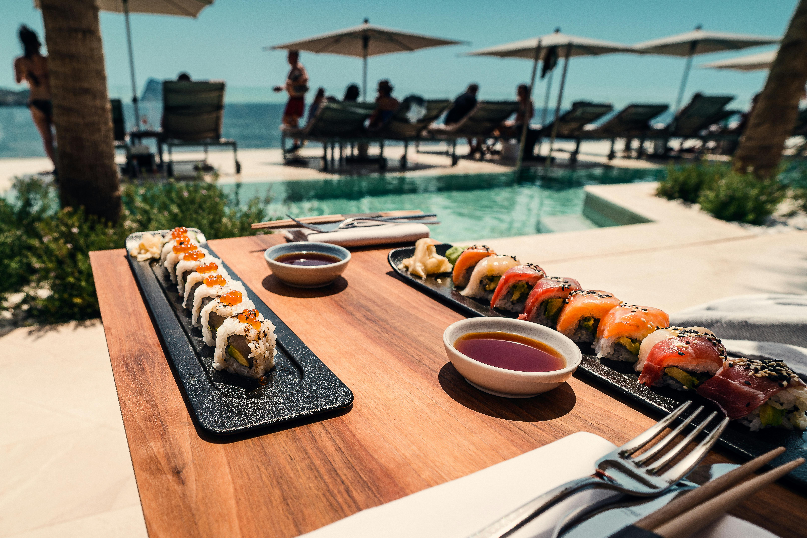
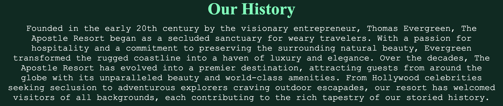
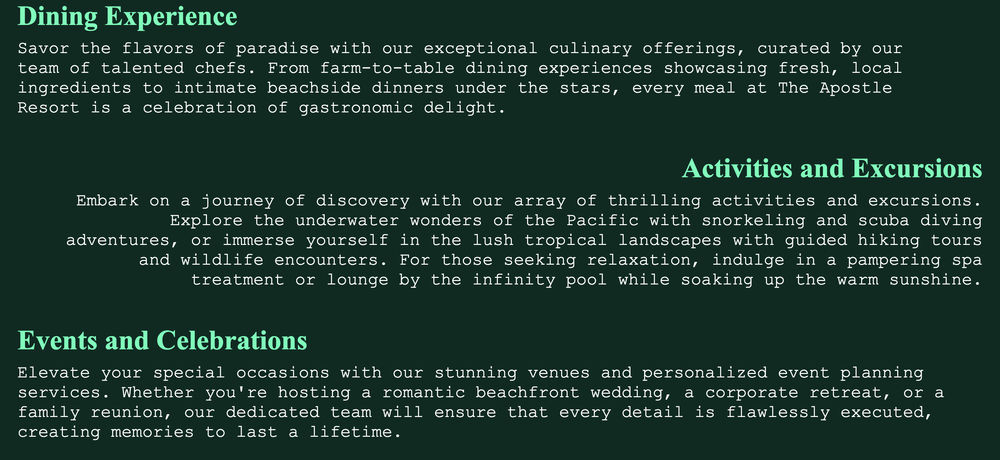
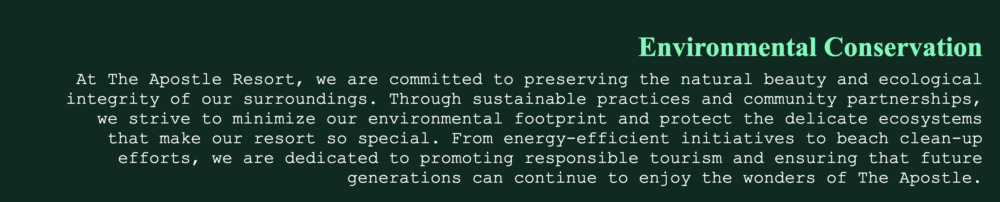

* Footer 
    * Contains all relavent contact/social information, including: location, social media, contact details, and a link to the contact page.
    * This allows users to take their interest further should they make the decision.
    * This footer is not displayed on the contact page, the 404 page, or the form recieved page, as it is not necessary implementation for those sections, and takes up space.

### Accommodations Page
* Provides information about the accommodation available at The Apostle.
    * Deluxe Suite - Sea Suite - Family Suite 
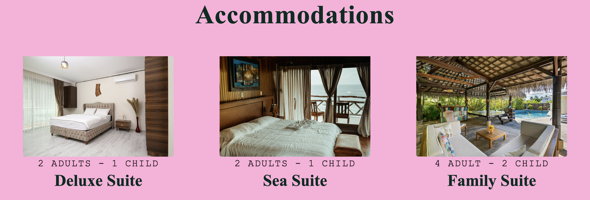
* The Family Suite 
    * Giving more depth to the Family suite will work to further entice and convince users that this resort is a good place to take their family. I chose the family suite for this over the other types because typically parents will take more consideration and time in researching where to take their children.

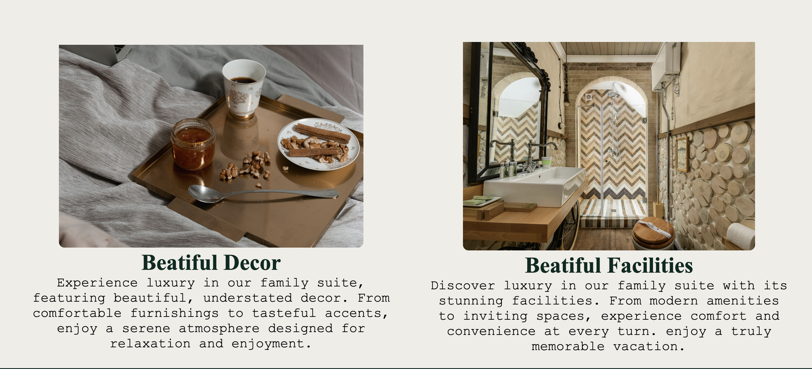
* Footer 
    * Contains all relavent contact/social information, including: location, social media, contact details, and a link to the contact page.
    * This allows users to take their interest further should they make the decision.
    * This footer is not displayed on the contact page, the 404 page, or the form recieved page, as it is not necessary implementation for those sections, and takes up space.

### Contact page 
* The Contact Form 
    * The form will be utilised by users to contact the resort for more information regarding booking availibility, prices, dates, and any other general questions they may have. 
    * There is a link to the contact page in the navbar, and also in the footer, meaning for users who are returning to the website after making their decision, they can use the link at the top without having to scroll all the way to the bottom, and anyone who has just reached the end of the website will next see an option reminding them that they can get in contact, which continues the flow of the website.    

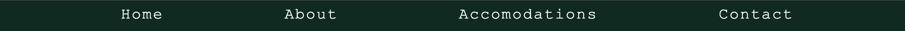

* Inside the form contain the following prompts: 
    * First Name
    * Last Name
    * Email Address
    * Message 
    * All must be filled out in order for the form to send, otherwise the user will recieve a prompt asking them to complete whichever section they had missed out. 
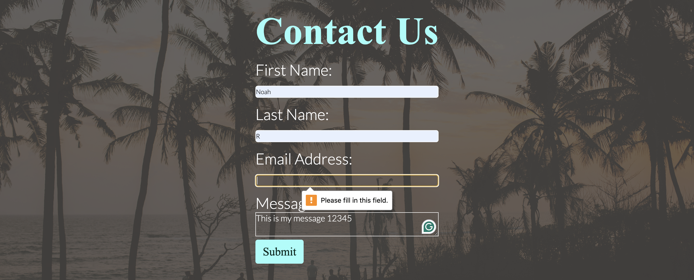
### Form Recieved page 
* Submitting the form 
    * After submitting the filled out form the User is directed to the Form Recieved page where they will be thanked, and assured that a reply will be dispatched soon. 
    * The User will also have the option to return back to the website in the navbar.
    * If the link doesnt work, the user will instead be be directed to the 404 page, in which they will be informed an error has occured, given the opportunity to return back to the main webpage, and also advised to try again later.

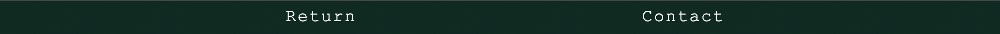
## Existing Features
* Responsive webpage
    * Site responds well to all screen sizes, with no major bugs or errors occuring.
* Interactive sections
    * Site contains interactive elements for the user to utilise, the nav dropdown toggle for smaller screen sizes being an example. 
* Three different pages, each containing multiple different sections 
    * Home page/Landing page:
        * Navbar
        * About Us section, containing:
            * History section.
            * general information section.
        * Footer, containing link to Contact form fillout page.
    * Accommodations Page:
        * Navbar
        * Deluxe Suite, Sea Suite, Family Suite.
        * Family Suite section.
        * Decor and Facilities section.
        * Footer, containing link to Contact form fillout page.
    * Contact Page: 
        * Navbar
        * Form
    * Form Recieved Page:
        * Navbar 
        * Thank you message
    * 404 page: 
        * Navbar 
        * Error message

### Potential Future Implementations 
* Possible Future Features:
    * Page Informing users of activities local to the area that are not a part of the resort.

    * Interactive Google maps section.

    * JavaScript code, to view booking slots and availability.

    * Improved Form, using JavaScript.
    
## Design 

### Wireframes 

## Technologies Used 

* Visual Studio Code
    * All development done through Visual Studio Code IDE 
* GitHub 
    * All files hosted and stored on GitHub, deployed through Git Pages.
* Git 
    * Used to commit and push code from Visual studio Code IDE to GitHub
* HTML 
    * Used throughout the development of the website
* CSS 
    * Used throughtout the development of the website in an external file
* Font Awesome 
    * Icons used throughout the website such as the social media icons where obtained from https://fontawesome.com/
* Google Fonts  
    * Fonts used throughout the website where obtained from https://fonts.google.com/
* Favicon.io
    * Favicon used in website, imported from https://favicon.io/
* Figma 
    * Wireframes were made through https://www.figma.com/
* Pexels 
    * Images sourced from https://www.pexels.com/

## Testing 
### Responsiveness 
All pages have been tested for responsivesness from 320px in Chrome developer tools, and through https://www.websiteplanet.com/webtools/responsive-checker/ and are responsive as defined in [WCAG 2.1 Reflow criteria for responsive design](https://www.w3.org/WAI/WCAG21/Understanding/reflow.html)

* Steps to test 
    * Navigate to [The Apostle](https://noahdr17.github.io/The_Apostle/)
    * Open Developer tools 
    * Set width to 320px 
    * Increase width incrementally while checking for unresponsiveness

* Expected outcome: 
    * Website is responsive across all screen sizes.
    * Images are not stretched or pixelated.
    * There is no horizontal scroll.
    * There is no overlap.

* Outcome: 
    * Website behaved as expected, except for slight overlap of the navbar over the About us header.

* Fix
    * Change padding top from 25px to 50px, for h2 element in About section.

* Test Again
    * As expected, no more deviencies from the Expected outcome after fixing about h2 overlap. 

Website was also tested using Iphone SE, Ipad mini, air and pro, macbook air, and Galaxy fold.

### Accessibility 
To test for accessibility i utilised the site, [Wave Accessibility](https://wave.webaim.org/) 

* The testing was carried out to ensure these criteria are met: 
    * colour contrast meets the specified criterea following the [WCAG 2.1 Contrast Guidelines](https://www.w3.org/WAI/WCAG21/Understanding/contrast-minimum.html).
    * All non text based elements and files have relavent alt text and aria-labels.
    * Colour contrast meet the minimum standards of [WCAG Contrast Guidelines](https://www.w3.org/WAI/WCAG21/Understanding/contrast-minimum.html).
    * Header levels are not missed or skipped to enable content to be relayed in the correct order.
    * All content is contained within relavent semantic markup.
    * Correct language attribute has been set for the html pages.
    

Error 1: Empty label, found in [Wave Accessibility](https://wave.webaim.org/)
Fix: Following the instructions from [Accessibility Tips and Tricks](https://medium.com/web-accessibility-tips-tricks-and-techniques-for/web-accessibility-tip-visually-hidden-text-for-screen-readers-a52d954d9711#:~:text=sr%2Donly%20declaration%20block%20does,invisible%20to%20the%20human%20eye) Added the required HTML and CSS to add element into the label which was not visible but removed the empty label error which occured when testing.

### Home Page Accessibility Testing 
Warning 1: "Suspicious alternative text", the image in the about us section had an alt text of "image of pool", this is not specific enough to get a proper idea of what the image is, it also has unnecessary text describing it as an image, when the screen reader already knows that.
Fix: Add more detail to the alt description
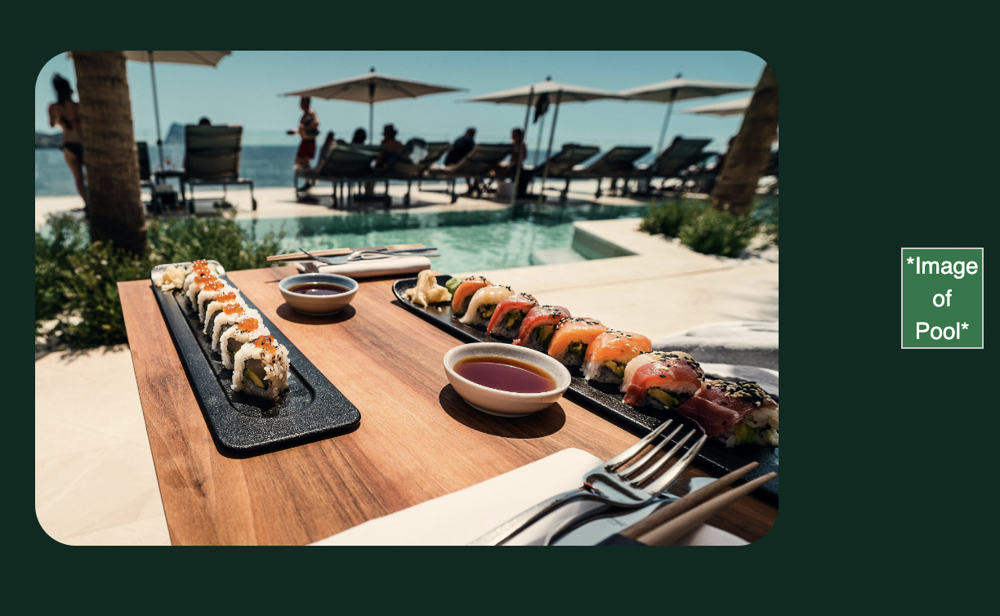

Warning 2: "Missing first level heading" in the home section, there isnt a h1 heading. 
Fix: Change the h2 element "The Apostle", into a h1 element.
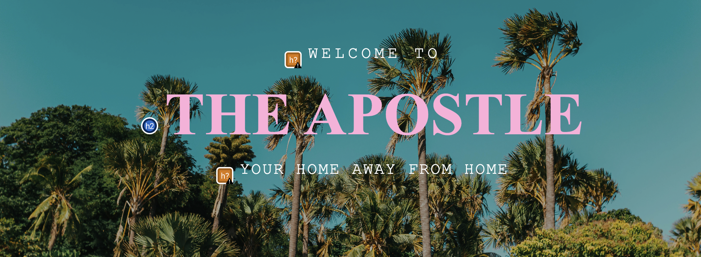

Warning 3: "2x possible headings" there are two paragraph elements that appear to be a heading but arent a heading. 

Fix: Change those paragraph elements into h3 elements, however i have chose not to implement those changes since i have specifically styled it so that the h1 element is between the two paragraph elements as it follows the visual style i want for the page.

Warning 4: "redundant link" there are two elements in the index.html file that link to the contact page, 
this means the screen reader will read the link out twice. 
Fix: i have chose not to fix this as i specifically placed two links in two draw attention and remind the user about the contact page, as this would create a higher chance the user will follow the link.
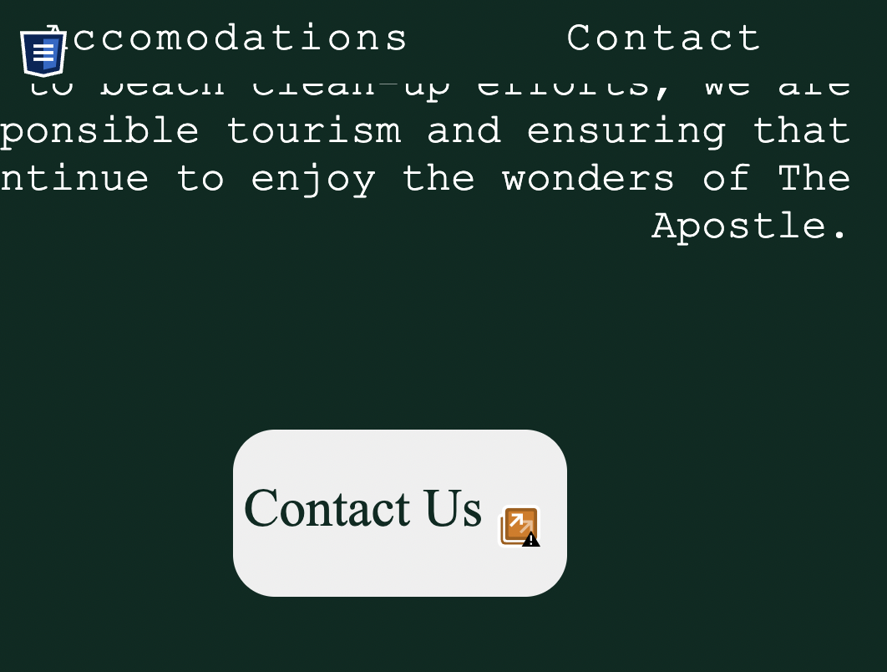

### Accommodations Page Accessibility Testing 
Warning 1: "Missing 1st level heading" Same with the warning in the home page, there isnt a h1 element for the Accommodations page.
Fix: change the Accommodations h2 into a h1.

Warning 2: "redundant link" there are two elements in the accommodations.html file that link to the contact page, this means the screen reader will read the link out twice. 
Fix: i have chose not to fix this as i specifically placed two links in two draw attention and remind the user about the contact page, as this would create a higher chance the user will follow the link.

### Contact Page Accessibility Testing 
Warning 1: "Missing 1st level heading" Same with the warning in the other pages, there isnt a h1 element for the contact page.
Fix: change the Contact h2 into a h1.

### Form Recieved Page Accessibility Testing 
No warnings specific to this page
### 404 Page Accessibility Testing
No warnings specific to this page

## Functional Testing 

* Navigation Bar
    * Testing was done by clicking each nav link on each page and ensuring they navigated to the correct link.

Expected Outcome:
After clicking a link, the user should be correctly navigated to the location of the link with no errors occuring.

Actual outcome: website behaved as expected, correctly navigating the user based on which link they clicked on.

* Contact Form 
    * The Contact Form was tested by first incorrectly attempting to fill it out and clicking the submit button, and then after by correctly filling it out once ensuring the form must be correctly filled out before form submittion becomes available.

* Steps to test Contact Form: 
    * Purposely incorrectly filling out the form.
        * Navigate to the contact page.
        * Attempt to submit the form with none of the inputs filled out.
        * Ensure prompts pop up informing you of the form requirements, instead of submitting the empty form.
        * Go down one by one filling each out and testing before moving onto the next.
        * For the email input, attempt to fill the email out without putting in the "@" symbol, ensure the 
        prompt appears reminding you of its necessity, and the requirements for the email.

Now that the form is filled out correctly the next steps are submitting it and testing it takes you to the Form recieved page. 

* Steps to test 
    * Submit filled out form.
    * User should be redirected to Form Recieved page.

Expected Outcome: 
Form only submits when all required inputs are correctly filled out, form successfully navigates to Form Recieved page, with no errors.

Actual Outcome:
Form behaved as expected, displaying requirement prompts for missed inputs or incorrectly filled out inputs. 
and upon successfully filling out the form and submitting, the user is then navigated to the form recieved page with no errors. 

* Social media icon links 
    * Testing was carried out to ensure that you are navigated to an external page correctly depending on which link you clicked.

* Steps to Take: 
    * Click each link and test that they take you to the correct location, and that it opens the link onto an external tab, since it is an external link.

Each link worked as expected opening the link onto an external tab.

### Validator Testing 
* HTML 
    * Any errors shown in validator where fixed until code returned no more errors when passed through.
[HTML](docs/readme_media/html-verification.jpg)

* CSS 
    * Any errors shown in validator where fixed until code returned no more errors when passed through.
[CSS](docs/readme_media/css-verification.jpg)
## Deployment

## Credits 

### Content 

### Media 

### Acknowledgements 