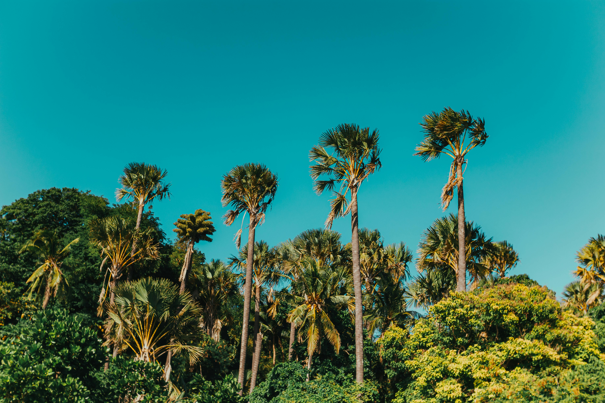

# The_Apostle
Portfolio Project One:
The Apostle is a website that informs users about the luxury spa and holiday resort "The Apostle", it also aims to provide the users with a method to get in contact with the hotel for the purposes of booking a stay or getting more in depth information regarding the resort. View the live link [here](https://noahdr17.github.io/The_Apostle/)

## UX

## Features
### Global Features: 
* Navigation Menu 
    * Contains a link to the Home, About Us, Accommodations, and contact pages, and is responsive on all devices.
    * This allows users to easily navigate through the site.
    * With screen sizes with a width below 768px, the navbar gains a dropdown icon to better accomodate the links on a smaller screen size.

* Favicon 
    * Spans all pages of the website.
    * Allows users to easily distinguish the site among other tabs.

* 404 
    * The 404 page makes it easier for the user to return to the website.
    * Will display if the user utilises a broken link.

### Landing Page 
* Layout 
    *Contains a small amount of text meant only to hook the attention of the reader and prompt them to scroll
    *Avoids overwhelming the user with imformation as soon as they open the page.

* Background image
    * Immediately sets the tone for the website, creating a visually aesthetic and welcoming first impression.
    * sets the baseline for the colours that will be used throughout the site.

* About Us Section
    * This provides information about "The Apostle" to the user.
    * Includes an image which showcases the pool bar.
    * The history section provides information on The Apostle's past, and how it came to be, this gives the resort more life and depth.
    * following the history section we have more general information, Dining Experience, Activities and Excursions, Events and Celebrations, and Information about The Apostle's passion for environmental conservation. This works to give more "meat" to the website, making it seem more realistic.

    
* Footer 
    * Contains all relavent contact/social information, including: location, social media, and a link to the contact page.
    * This allows users to take their interest further should they make the decision.

## Existing Features

## Technologies Used 

## Testing 

## Deployment

## Credits 

### Content 

### Media 

### Acknowledgements 